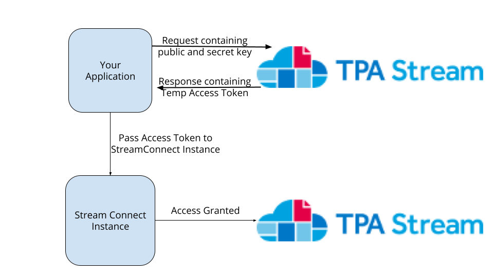

# Connect Access Token

This is an advanced security funcitonality intended for implementors who would like an extra layer of security on the stream connect sdk. This set-up is required if an implementor intends to use the Fix-Credentials capabilities of the stream connect sdk.

## Your Public Key vs Your Secret Key
If you have opted into using the connect access token for the stream connect sdk, then you will have been provided 2 keys in association to your sdk instance. One key will be made clear to be your `sdkToken` this is a public key not meant to be hidden. This key will go into the `sdkToken` key on your StreamConnect initialization object.

```
StreamConnect({
    sdkToken: "Your-Sdk-Token"
})
```

The other key you receive is a secret key not meant for public consumption. 

**WARNING**
-----------
Never put your SDK secret key in a place were a user could potential see it. That means never put it in the StreamConnect initialization object.


## How to use your Secret Key
Your secret key is meant to be used to generate temporary tokens which you will then pass to your StreamConnect initialization object.

The pattern is as followed.


1. Confirm that your secret key is stored on your application.
2. Make a POST request to https://app.tpastream.com.com/api/create-connect-token
    * The Body should have `{"connect_access_key": "", "connect_secret_key": ""}`
3. You will recieve back a response with json data `"data": "some-super-long-jwt"`
4. Take the value from that response's data key and pump it up to your StreamConnect instance through `connectAccessToken`

Your init object should look like
```
StreamConnect({
    "sdkToken": "<Your-Public-Access-Key>",
    "connectAccessToken": "<some-super-long-jwt>"
})
```

This JWT expires after 1 hour.