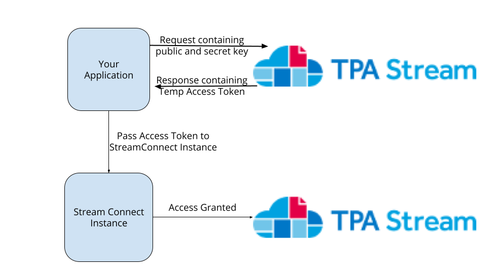

# Connect Access Token

This is an advanced security funcitonality intended for implementors who would like an extra layer of security on the stream connect sdk. This set-up is required if an implementor intends to use the Fix-Credentials capabilities of the stream connect sdk.

## Your Public Key vs Your Secret Key
If you have opted into using the connect access token for the stream connect sdk, then you will have been provided 2 keys in association to your sdk instance. One key will be made clear to be your `sdkToken` this is a public key not meant to be hidden. This key will go into the `sdkToken` key on your StreamConnect initialization object.

```
StreamConnect({
    sdkToken: "Your-Sdk-Token"
})
```

The other key you receive is a secret key not meant for public consumption. 

**WARNING**
-----------
Never put your SDK secret key in a place were a user could potential see it. That means never put it in the StreamConnect initialization object.


## How to use your Secret Key
Your secret key is meant to be used to generate temporary tokens which you will then pass to your StreamConnect initialization object.

The pattern is as followed.


1. Confirm that your secret key is stored on your application.
2. Make a POST request to https://app.tpastream.com/api/create-connect-token
    * The Body should have `{"connect_access_key": "", "connect_secret_key": ""}`
3. You will recieve back a response with json data `"data": "some-super-long-jwt"`
4. Take the value from that response's data key and pump it up to your StreamConnect instance through `connectAccessToken`

Your init object should look like
```
StreamConnect({
    "sdkToken": "<Your-Public-Access-Key>",
    "connectAccessToken": "<some-super-long-jwt>"
})
```

This JWT expires after 1 hour.

## Refreshing an expired token (0.8.1+)

Connect access tokens expire after 1 hour. When a member leaves your
SDK-hosting page open past that window and comes back to interact,
the next API call fails with a 422 and `error_code:
"expired_connect_token"`. The 0.8.1 SDK can recover transparently
**if** you wire a refresh hook — but the refresh has to go through
your server, because only your server holds the SDK secret key.

### Why this can't be automatic

The whole point of the connect access token is that the secret key
never reaches the browser. If the SDK could mint its own tokens, the
secret would have to be in JS code where any user with devtools could
read it. So the SDK can't refresh on its own — it can only ask your
server for a fresh token.

### Step 1: expose a refresh endpoint on your server

This endpoint does the same `POST` to `/api/create-connect-token`
that your original page-render did, returning the new JWT to the
browser. **Gate it with the same auth you use for the member's
session** — anyone who can call it can extend any member's SDK
session indefinitely.

**Flask:**

```python
from flask import jsonify, request
import requests

@app.route("/api/tpa-sdk-refresh-token", methods=["POST"])
@your_login_required
def tpa_sdk_refresh_token():
    response = requests.post(
        "https://app.tpastream.com/api/create-connect-token",
        json={
            "connect_access_key": app.config["TPA_SDK_PUBLIC_KEY"],
            "connect_secret_key": app.config["TPA_SDK_SECRET_KEY"],
        },
        timeout=10,
    )
    response.raise_for_status()
    return jsonify(token=response.json()["data"])
```

**Express:**

```js
app.post('/api/tpa-sdk-refresh-token', yourLoginRequired, async (req, res) => {
  const r = await fetch('https://app.tpastream.com/api/create-connect-token', {
    method: 'POST',
    headers: { 'Content-Type': 'application/json' },
    body: JSON.stringify({
      connect_access_key: process.env.TPA_SDK_PUBLIC_KEY,
      connect_secret_key: process.env.TPA_SDK_SECRET_KEY,
    }),
  });
  if (!r.ok) return res.status(502).json({ error: 'refresh failed' });
  const { data } = await r.json();
  res.json({ token: data });
});
```

### Step 2: wire `connectAccessTokenRefreshFn` on the SDK

```js
StreamConnect({
  // ... your existing config ...
  connectAccessToken: '<initial-token-from-page-render>',
  connectAccessTokenRefreshFn: async () => {
    const r = await fetch('/api/tpa-sdk-refresh-token', {
      method: 'POST',
      credentials: 'same-origin',
    });
    if (!r.ok) throw new Error(`refresh failed: ${r.status}`);
    return (await r.json()).token;
  },
});
```

When the SDK detects an expired token, it calls this function, swaps
the new value into its `X-Connect-Access-Token` header, and retries
the failed request — the member sees no error. Multiple parallel
failed requests share a single refresh attempt (stampede guard) so
your endpoint gets called once per expiry cycle, not once per request.

### Fallback: notification-only

If you can't add a refresh endpoint (legacy host, static site, etc.),
wire `onConnectAccessTokenExpired` instead. The SDK will surface the
expiry to your callback (and dispatch a
`tpastream-connect-token-expired` CustomEvent on `window`) so you can
prompt the member to reload:

```js
StreamConnect({
  // ... your existing config ...
  onConnectAccessTokenExpired: () => {
    if (confirm('Your session has expired. Reload to continue?')) {
      window.location.reload();
    }
  },
});
```

The reload triggers a fresh page render, which mints a fresh
`connectAccessToken` server-side. The trade-off versus the refresh
hook is that the member loses any in-progress credential entry.

## Mid-session token refresh (Patient Access API redirect)

After a Patient Access API redirect completes, `app.tpastream.com`
appends a fresh `?accessToken=...` query parameter to the return
URL. The 0.8 SDK reads it automatically on init and uses it for the
rest of the session, overriding any stale `connectAccessToken` baked
into the page. The token is stripped from the URL via
`history.replaceState` so it doesn't end up in the browser history
or address bar.

Note: `replaceState` runs after the SDK script loads, so any
resources or third-party scripts loaded by the host page *before*
the SDK runs (analytics beacons, ad pixels, anything in the `<head>`
that fires its own requests) can still see the original
token-bearing URL in the Referer header. If your host page loads
anything sensitive before the SDK, either move it after the SDK
script tag or strip the `accessToken` query param server-side
before serving the post-redirect page.

See [Client Usage > Redirect query
parameters](./client-usage.md#redirect-query-parameters-patient-access-api)
for the full mechanics.

## See also

* [Fix Credentials](./fix-credentials.md): the primary consumer of
  `connectAccessToken`
* [Patient Access API (Interop)](./interop.md): the redirect flow
  that drives the mid-session refresh above