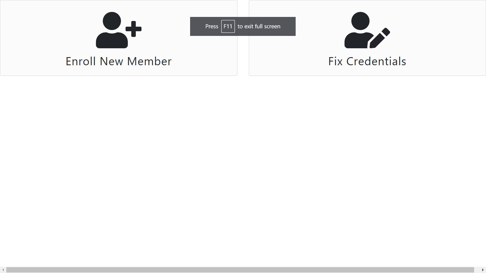

# Fix Credentials

This allows users of the SDK to address issues in their various policy holder credentials within the SDK system itself. This is advanced functionality
that is available as of version `v0.6.0` and requires [Connect Access Token](./connect-access-token) to be enabled on your SDK instance.

## New Init options

* `fixCredentials` -- A boolean value which enables the functionality.
    * This only will init in the SDK if `connectAccessToken` is also enabled and correctly set per run.
* `doneSelectEnrollProcess` -- A new callback for the new SDK start widget.
* `doneFixCredentials` -- The Fix Credentials step callback.

## Flow
Fix credentials is a seperate but related function to enrollment. When enabled the SDK will perserve the old flow except for the initial starting widget.

The starting page will look like the above picture. The user will either select to create new members as normal or just fix credentials which have been flagged by the TPAStream system as invalid.

Once selected the user will be directed to a similar page to Choose Payer but instead of a list of payers it will be a list of already created members within the TPAStream system. These policy holders all have various issues with them and can then be corrected by clicking to the form same as the normal SDK Flow.