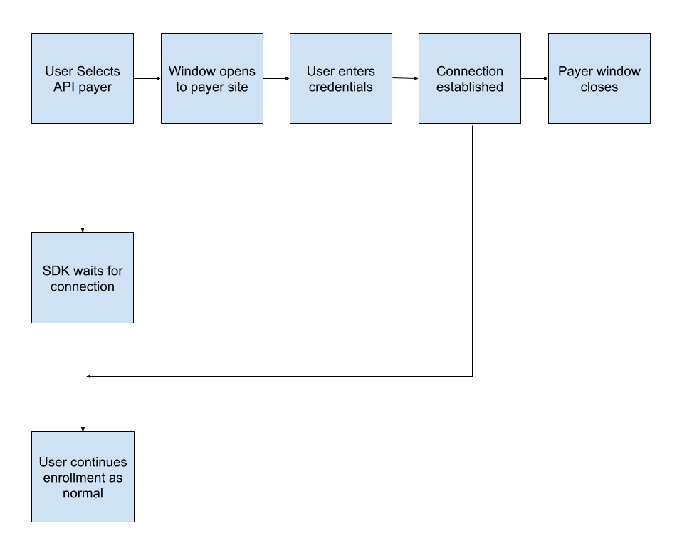

# Interop
TPAStream now supports Interoperability Access APIs for SDK users. This new way of patient access apis allows a user to authenticate securely on a payers website and then from there have a 90 day access token save within our system which we can use to harvest the data. In order to support this functionality we have implemented a new field to integrate with the interoperability payers known as `enableInterop`

## Client Usage
When `enableInterop` is set and your given tenant / token is configured within TPAStream to be interoperability compliant you will gain access to certain payers within our system which will require opening a new window to the payer webpage in order to service.

Here's how the flow goes at a top level:

As you can see there is a new window within the center of the flow where the user will go through the Payer Website then the SDK will detect the connection to TPAStream and continue normally.

