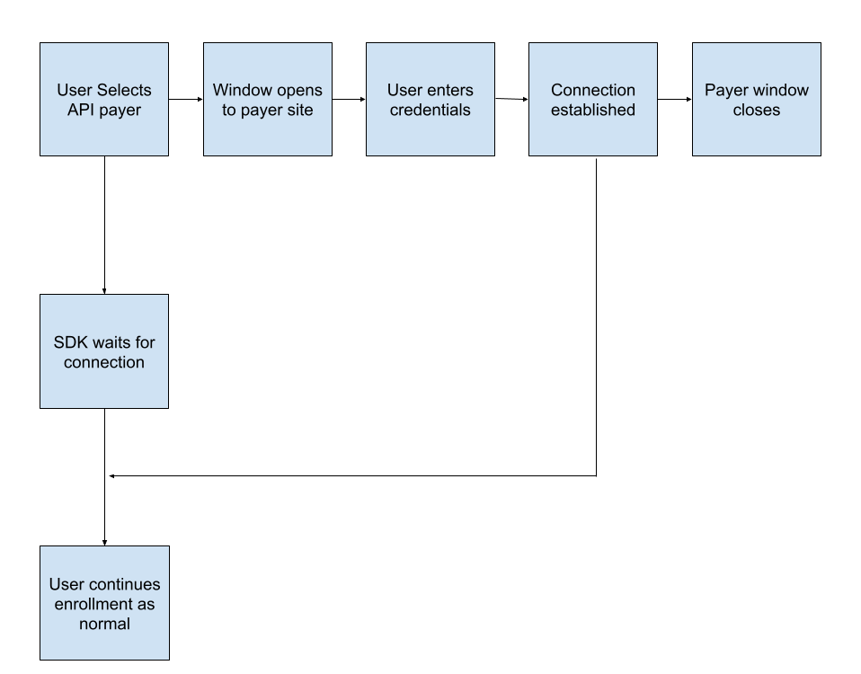

# Patient Access API (Interop)

TPAStream supports carrier Patient Access APIs for SDK users. Instead of collecting carrier credentials inline, the user authenticates on the carrier's own website and TPAStream receives a 90-day access token that it uses to harvest the data. The init option that enables this flow is **`enablePatientAccessAPI`**.

> Renamed in 0.8. The option was originally called `enableInterop`; both names still work indefinitely. Passing `enableInterop` logs a one-time console deprecation warning but otherwise behaves identically. New integrations should use the canonical name.

## Client Usage
When `enablePatientAccessAPI` is set and your tenant / token is configured within TPAStream as Patient Access API-compliant, the SDK exposes payers that authenticate via a redirect to the payer website instead of an inline credentials form.

Here's how the flow goes at a top level:

As shown above, the user is sent to a new window on the payer's website, completes authentication there, and the SDK detects the connection back to TPAStream and continues normally.

## Single-page variant

Pass **`enablePatientAccessAPISinglePage`** instead of (or in addition to) `enablePatientAccessAPI` to perform the redirect in the current tab rather than opening a new window. When both are set, single-page wins.

The legacy alias `enableInteropSinglePage` is also still accepted with the same deprecation-warning treatment.

## Redirect query parameters

After the carrier redirect completes, the SDK reads two URL parameters automatically on load:

* `?accessToken=...`: a fresh connect-access token minted by `app.tpastream.com`.
* `?forceTPAStreamSdkEnd=1`: set in the single-page variant to tell the next load to skip straight to the end widget.

Both are stripped from the URL via `history.replaceState` so they cannot leak via browser history or autofill. See [Client Usage > Redirect query parameters](./client-usage.md#redirect-query-parameters-patient-access-api) for the full mechanics.
