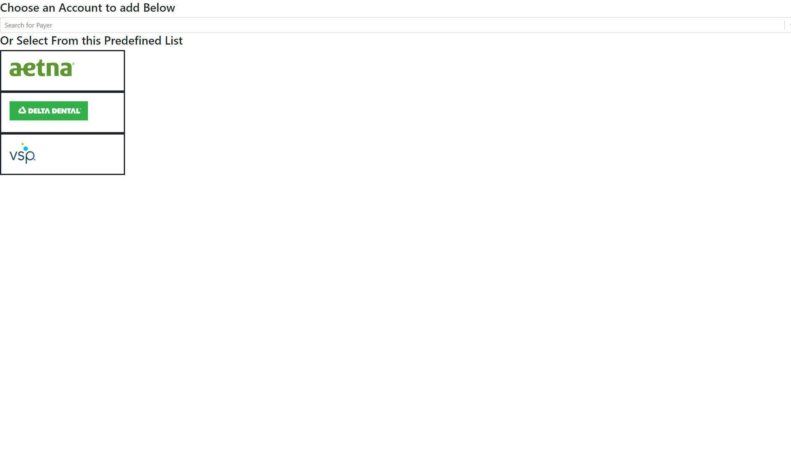
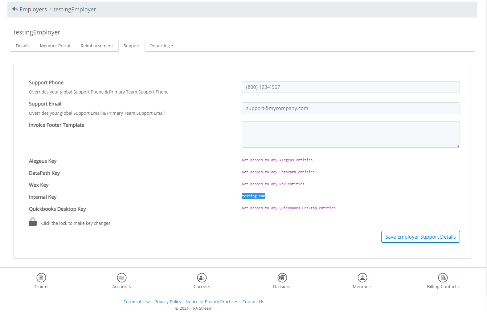

# Quick Start
A guide to get an implementation up and running as quickly as possible. This guide
will not go into the deep customization of the SDK, but rather will look at getting
the SDK to be configured properly, to be able to submit credentials and validate them.

## Step 1 -- Import the SDK
This guide will use a simple html document with the configuration of the StreamConnect SDK set in an html head script.
The html surrounding the SDK will not change throughout the guide.

Here is what the test htmlscript looks like.
```html
<!DOCTYPE html>
<html>
    <head>
        <link rel="stylesheet" href="https://stackpath.bootstrapcdn.com/bootstrap/4.3.1/css/bootstrap.min.css" integrity="sha384-ggOyR0iXCbMQv3Xipma34MD+dH/1fQ784/j6cY/iJTQUOhcWr7x9JvoRxT2MZw1T" crossorigin="anonymous">
        <script src="https://app.tpastream.com.com/static/js/sdk.js"></script>
    </head>
    <body></body>
</html>
```

`<script src="https://app.tpastream.com.com/static/js/sdk.js"></script>` in the head  will bring down the latest version of the StreamConnect SDK. If for any reason you require a previous version or wish to set the SDK to a specific version change the src to something like 
`<script src="https://app.tpastream.com.com/static/js/sdk-v-0.5.4.js"></script>`. The SDK CDN provides up to 10 minor version prior.

## Step 2 -- Add element for SDK to hook to and init SDK
```html
<!DOCTYPE html>
<html>
    <head>
        <link rel="stylesheet" href="https://stackpath.bootstrapcdn.com/bootstrap/4.3.1/css/bootstrap.min.css" integrity="sha384-ggOyR0iXCbMQv3Xipma34MD+dH/1fQ784/j6cY/iJTQUOhcWr7x9JvoRxT2MZw1T" crossorigin="anonymous">
        <script src="https://app.tpastream.com.com/static/js/sdk.js"></script>
        <script>
            window.StreamConnect({
                el: '#sdk-hook',
                isDemo: true,
            })
        </script>
    </head>
    <body>
        <div id="sdk-hook"></div>
    </body>
</html>
```

The SDK will nest all of its elements beneath whatever div you target via a css selector in the `el` element. It is suggested
that an implementor starts the SDK init with `isDemo` set to true as shown above so that an implmenetor can see the initial SDK page.

*Demo mode is incapable of saving credentials or validating credentials.

If you then open up the above html in a browser you should see something close to the following.


## Step 3 -- Add sdk Token
```html
<!DOCTYPE html>
<html>
    <head>
        <link rel="stylesheet" href="https://stackpath.bootstrapcdn.com/bootstrap/4.3.1/css/bootstrap.min.css" integrity="sha384-ggOyR0iXCbMQv3Xipma34MD+dH/1fQ784/j6cY/iJTQUOhcWr7x9JvoRxT2MZw1T" crossorigin="anonymous">
        <script src="https://app.tpastream.com.com/static/js/sdk.js"></script>
        <script>
            window.StreamConnect({
                el: '#sdk-hook',
                isDemo: false,
                sdkToken: 'Your-SDK-Token-Here', // Same as apiToken: 'Your-SDK-Token-Here'
            })
        </script>
    </head>
    <body>
        <div id="sdk-hook"></div>
    </body>
</html>
```

After setting the `sdkToken` you will see the following page on your html.


That is ok! In order to initialize the SDK you will need to have quite a few more values. So for now it won't properly init.

If you go into the developer tools for your site, you can get several helpful errors from the various requests which the SDK
is generating. In this case the following init errors will likely provide `422` responses.

Example Error:
```
You are missing required parameters in user. We require [firstName, lastName, email]. For more documentation on how the User Configuration works see https://github.com/TPAStream/stream-connect-js-sdk/blob/master/docs/client-usage.md#client-usage
```

If you recieve a `404` error at this step it is possible that your `sdkToken` is not configured properly. Stick with the guide to see
if the error naturally resolves as you add the rest of the configuration.

## Step 4 -- Add user configuration
```html
<!DOCTYPE html>
<html>
    <head>
        <link rel="stylesheet" href="https://stackpath.bootstrapcdn.com/bootstrap/4.3.1/css/bootstrap.min.css" integrity="sha384-ggOyR0iXCbMQv3Xipma34MD+dH/1fQ784/j6cY/iJTQUOhcWr7x9JvoRxT2MZw1T" crossorigin="anonymous">
        <script src="https://app.tpastream.com.com/static/js/sdk.js"></script>
        <script>
            window.StreamConnect({
                el: '#sdk-hook',
                isDemo: false,
                sdkToken: 'Your-SDK-Token-Here',
                user: {
                    firstName: 'Testing',
                    lastName: 'User',
                    email: 'youremail+testingsdk@email.com'
                },
            })
        </script>
    </head>
    <body>
        <div id="sdk-hook"></div>
    </body>
</html>
```

An implementor can think of a user as a participant which has the credentials on whatever insurance carrier is being interacted with.
In order to save these members into our system we require a first name, last name, and an email. While eventually this data will
come from real user data on your site, while configurating the sdk we suggest you use test emails.

*Warning* If you have an Admin account on TPAStream you will not be able to use that account with the StreamConnect SDK. Instead use
a different email with your enrollment process. Or if you are using GMail, you can follow the pattern `youremail+testingsdk@gmail.com`.
This will allow you to set-up a new account in TPAStream which is separate from your current one, but also have the emails go to
your current email.

## Step 5 -- Employer configuration
```html
<!DOCTYPE html>
<html>
    <head>
        <link rel="stylesheet" href="https://stackpath.bootstrapcdn.com/bootstrap/4.3.1/css/bootstrap.min.css" integrity="sha384-ggOyR0iXCbMQv3Xipma34MD+dH/1fQ784/j6cY/iJTQUOhcWr7x9JvoRxT2MZw1T" crossorigin="anonymous">
        <script src="https://app.tpastream.com.com/static/js/sdk.js"></script>
        <script>
            window.StreamConnect({
                el: '#sdk-hook',
                isDemo: false,
                sdkToken: 'Your-SDK-Token-Here',
                user: {
                    firstName: 'Testing',
                    lastName: 'User',
                    email: 'youremail+testingsdk@email.com'
                },
                employer: {
                    name: 'testingEmployer', // Only provide this if your employer does not exist in TPAStream yet.
                    systemKey: 'testing-sdk',
                    vendor: 'internal', // This will almost always be internal
                },
            })
        </script>
    </head>
    <body>
        <div id="sdk-hook"></div>
    </body>
</html>
```

When implementing the SDK all carrier credentials will be nested under an employer in TPAStream. This block will define which
employer your are interested in.

To get the Key for an existing employer go to the [Employers Page](https://app.tpastream.com.com/b/employers) in the TPAStream Admin portal. From there search up the desired employer. Then enter the details page of said employer. From there navigate to the **support** tab.

You will see a screen similar to this:


You will see `Internal Key` as a section. Grab the key directly across from that and put it into the systemKey config option in the employer object. In this case it is highleted and called `testing-sdk`.


# Step 6 -- Init

Now that you have set up the configuraiton as follows you should be able to reload that page you setup before and init the SDK.

The SDK is now a relatively unstyled blank template, but it will now function to submit carrier credentials.

To style the SDK you will use the various callbacks which are configured at each of the steps for the SDK.
For more details on how to implement the more advance SDK functionality see [Client Usage](client-usage.md)
