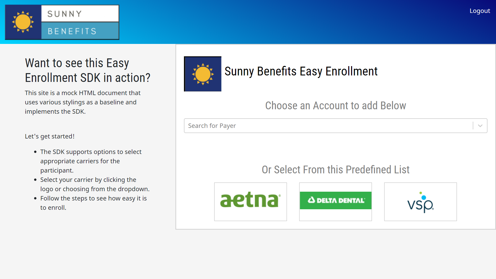
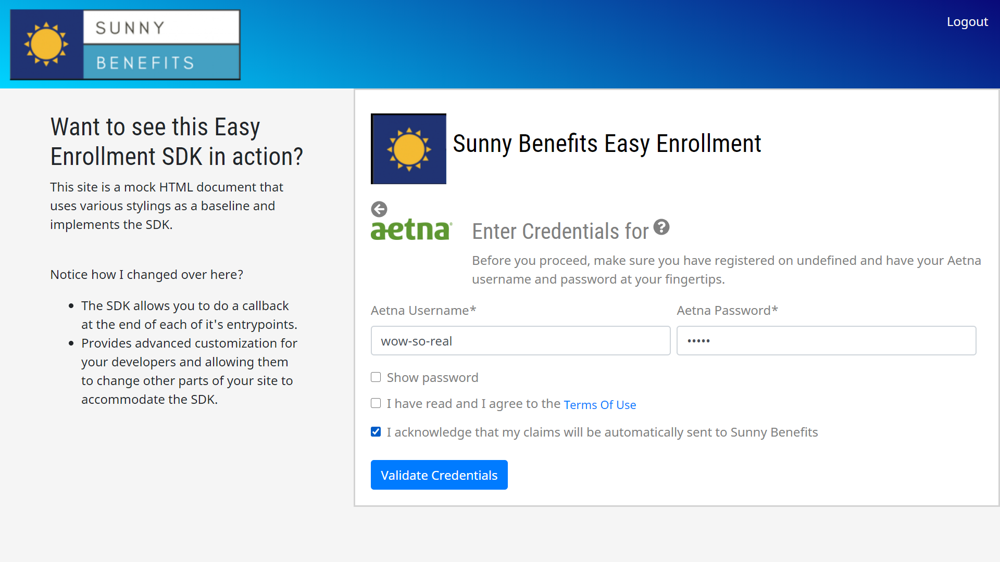
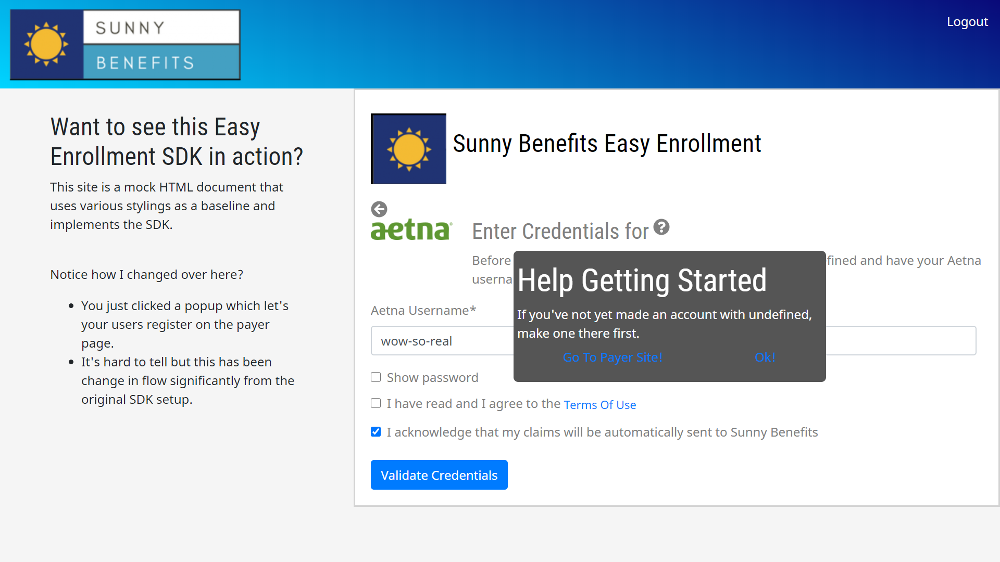
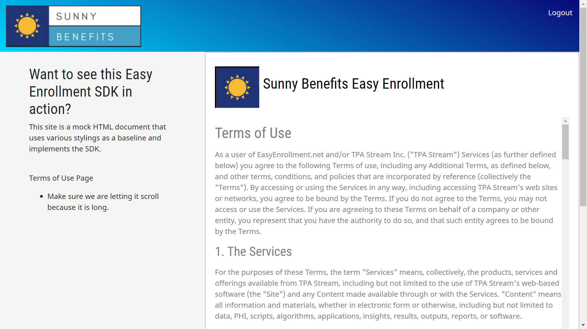
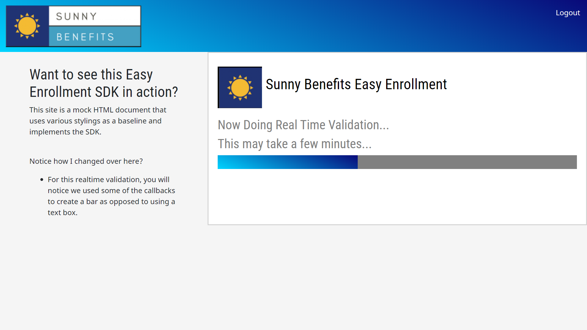

# SDK Flow
## Set-Up
The SDK will not render on the page until `StreamConnect` is called. Meaning that implementors can setup the page to go through various flows and have the SDK generate as part of a button click and or other method. The SDK will render beneath whatever element-hook the implementor attaches it to. As part of this the implementor should have setup all the necessary piping and configurations on a per-user basis. Once this configuration is complete and the SDK is called it shall render it's first widget `choose-payer`
## Choose-Payer
This is the first widget to render on the page. It will appear as one of two forms. Either as a couple of images of payer logos or as a dropdown (Note: The dropdown can have the images appear as well if they are specifically configured on the employer OR there are credentials already existing for this user on said payer). 

If the SDK is configured to demo mode you can see what each individual style will look like. Once the user clicks on one of these images or selects from the dropdown, the next widget renders: `enter-credentials`.

Here is what choose-payer might looks like (DISCLAIMER: All screenshots are configured in demo-mode and thus have incomplete data)

## Enter Credentials
The second widget to render on the page is the `enter-credentials` widget. This widget handles the form for the specific carrier site. This page will have fields for usernames, passwords, security questions, dates of birth, and terms of service acceptance.

The SDK will handle all the validation of the form. You can interface more thoroughly with the submit request via the `donePostCredentials` callback.

This widget is also home to some sub-widgets which have their own callbacks: `terms-of-service` and `pop-up`.

Here is what a form might look like

## Enter Credentials Sub-Widgets
#### Pop Up
This widget is accessed by clicking the question mark on the page. This pop-up has a link to the carrier site.

#### Terms of Service
This widget contains the TPAStream terms of service

## Real Time Validation
This widget is an intermediate widget between submitting credentials and the SDK end state. It exists to act as a loading page while the TPAStream crawl engine is tyring to validate the credentials. *This logic can take up to 200 seconds before it decides the end status*

## Done Easy Enroll
This final widget will display an ending message for the user and allow them to retry and or submit credentials depending on their end status.