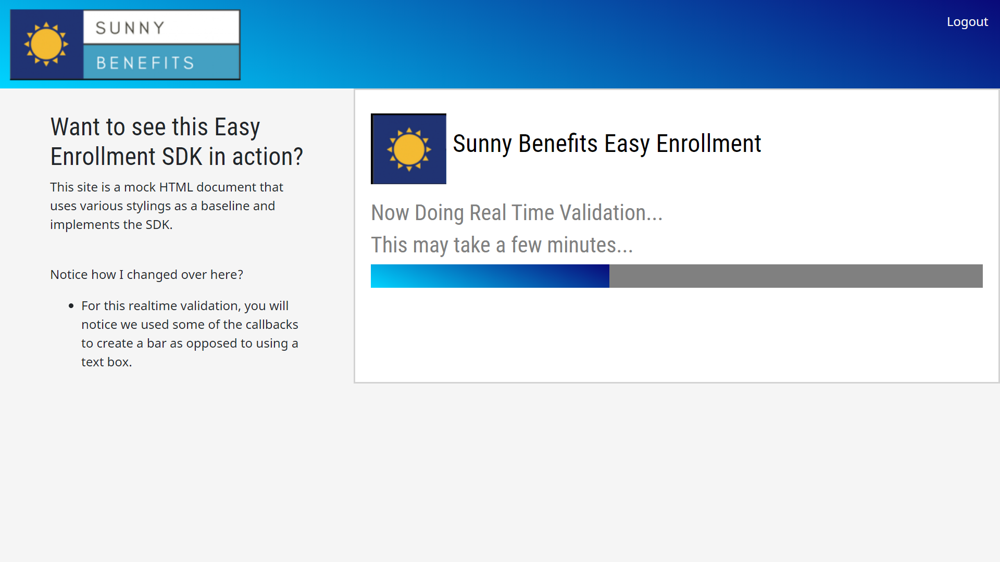

# SDK Flow
## Set-Up
The SDK will not render on the page until `StreamConnect` is called. Meaning that implementors can setup the page to go through various flows and have the SDK generate as part of a button click and or other method. The SDK will render beneath whatever element-hook the implementor attaches it to. As part of this the implementor should have setup all the necessary piping and configurations on a per-user basis. Once this configuration is complete and the SDK is called it shall render it's first widget `choose-payer`
## Choose-Payer
This is the first widget to render on the page. It will appear as one of two forms. Either as a couple of images of payer logos or as a dropdown (Note: The dropdown can have the images appear as well if they are specifically configured on the employer OR there are credentials already existing for this user on said payer). 

If the SDK is configured to demo mode you can see what each individual style will look like. Once the user clicks on one of these images or selects from the dropdown, the next widget renders: `enter-credentials`.

Here is what choose-payer might looks like (DISCLAIMER: All screenshots are configured in demo-mode and thus have incomplete data)

The dropdown variant looks like this when the listbox is open:

## Enter Credentials
The second widget to render on the page is the `enter-credentials` widget. This widget handles the form for the specific carrier site. This page will have fields for usernames, passwords, security questions, dates of birth, and terms of service acceptance.

The SDK will handle all the validation of the form. You can interface more thoroughly with the submit request via the `donePostCredentials` callback.

This widget is also home to some sub-widgets which have their own callbacks: `terms-of-service` and `pop-up`.

Here is what a form might look like

## Enter Credentials Sub-Widgets
#### Pop Up
This widget is accessed by clicking the question mark on the page. This pop-up has a link to the carrier site.

#### Terms of Service
This widget contains the TPAStream terms of service

## Real Time Validation

In 0.8 this is no longer a blocking intermediate widget. After the user submits credentials, the SDK opens a Server-Sent Events subscription to `/v3/sdk/progress/<task_id>/stream` and surfaces validation progress in a non-blocking hero element plus a corner-panel UI, while the rest of the flow remains interactive. Multiple validations can run in parallel; each one owns its own SSE subscription.

Auth on the SSE channel is a short-lived task-scoped JWT (audience `sdk:sse:progress`, bound to the user + validation task, 10-minute TTL) returned in the credential-submit response as `task_token`. The SDK forwards it as a `?token=...` query param on the SSE subscription; integrators do not need to handle the token directly.

State transitions arrive as they happen rather than on the 5-second polling cadence used in 0.7.x. The server-side stream has a hard ~10-minute deadline; if validation hasn't terminated by then the server emits a `timeout` event and closes the stream. The SDK transitions that validation to a `pending_async` state which keeps it visible in the hero / corner-panel UI (the wizard does NOT auto-advance to FinishedEasyEnroll). The user can keep using the SDK; when they return later, the next call to the backend will reflect whatever terminal state the validation reached.

`doneRealTime` still fires for back-compat. The `realtimeTimeout` init option is accepted but ignored (the timeout is now server-side).

## Done Easy Enroll
This final widget will display an ending message for the user and allow them to retry and or submit credentials depending on their end status.